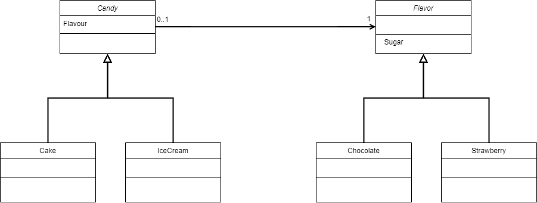

# ☕ Java Design Patterns

## Bridge

Bridge pattern separate the abstraction from the implementation, allowing them to be developed idependently and let the access to the abstraction part dissociate from the implementation part.

For example, lets say that we have a factory that makes two types of candy: cakes and ice cream. That's our abstraction.

For each candy, there's two flavours: chocolate and strawberry. That's our interface.

The bridge is between each candy with the flavours.

Each flavour adds some quantity of sugar to the recipe. That makes difference in the cake recipe, but not in the ice cream. So in the implementation of the abstract method `getSugar` for the cake, it must subtract the quantity of the sugar that comes from the flavor, and the ice cream just returns the base quantity.
