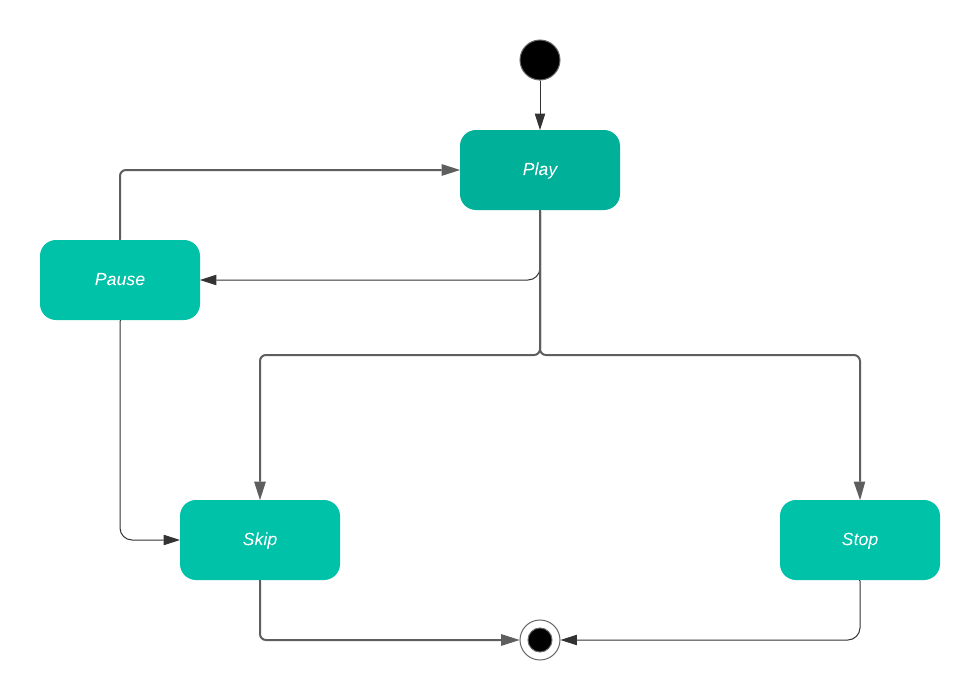

# ☕ Java Design Patterns

## State

State pattern is used when you need to control the state of an object. It will avoid to have nested many ifs and elses to control the state flow.

### Without State Design Pattern

If we want to create a keep track of the state of a music, that follows the diagram:



we would implement a class like below:

```java
public class Music {
    private String title;
    private String artist;
    private MusicState state;

    // constructor, getters and setters were ommited for simplification
}
```

where `MusicState` is an enum:

```java
public enum MusicState {
    PLAY, SKIP, PAUSE, STOP;
}
```

Then we have to implement ifs and elses in a method called `setState`, like so, to control the states:

```java
    public void setState(MusicState state){
        if(this.state.equals(MusicState.SKIP) || this.state.equals(MusicState.STOP)){
            return;
        }

        if(this.state.equals(MusicState.PLAY)){
            this.state = state;
            return;
        }

        if(this.state.equals(MusicState.PAUSE)){
            if(state.equals(MusicState.STOP)){
                return;
            }else {
                this.state = state;
                return;
            }
        }

```

### With State Design Pattern

Let's transform our `MusicState` enum in an interface:

```java
public interface MusicState {

    String getState();

    String play(Music music);

    String pause(Music music);

    String skip(Music music);

    String stop(Music music);
}

```

and now create for each state a class that implements our interface, and each method will have a different return depending of the class. Let's take `Play` and `Pause` as examples:

```java
public class Play implements MusicState {

    private static Play instance = new Play();

    public static Play getInstance() {
        return instance;
    }

    @Override
    public String getState() {
        return "▶️";
    }

    @Override
    public String play(Music music) {
        return "⚠️ Operation not allowed";
    }

    @Override
    public String pause(Music music) {
        music.setState(Pause.getInstance());
        return "⏸";
    }

    @Override
    public String skip(Music music) {
        music.setState(Skip.getInstance());
        return "⏭️";
    }

    @Override
    public String stop(Music music) {
        music.setState(Stop.getInstance());
        return "⏹️";
    }

}
```

```java
public class Pause implements MusicState {

    private static Pause instance = new Pause();

    public static Pause getInstance() {
        return instance;
    }

    @Override
    public String getState() {
        return "⏸";
    }

    @Override
    public String play(Music music) {
        music.setState(Play.getInstance());
        return "▶️";
    }

    @Override
    public String pause(Music music) {
        return "⚠️ Operation not allowed";
    }

    @Override
    public String skip(Music music) {
        music.setState(Skip.getInstance());
        return "⏭️";
    }

    @Override
    public String stop(Music music) {
        return "⚠️ Operation not allowed";

    }

}

}

```

> Note that these classes are singletons because they don't need more than one instance to work on our code.

Finally, we have to update our `Music` class to implement the method to each state:

```java
public class Music {
    // attributes, constructor, getters and setters were ommited for simplification

    public String play() {
        return state.play(this);
    }

    public String pause() {
        return state.pause(this);
    }

    public String skip() {
        return state.skip(this);
    }

    public String stop() {
        return state.stop(this);
    }

}
```

and we're done!
